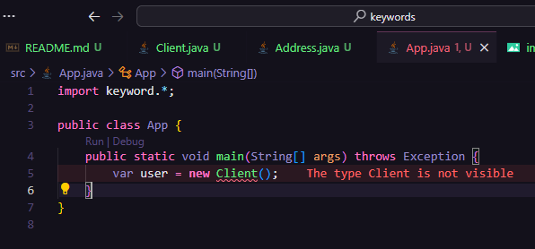

# Keywords

Neste momento iremos revisar alguns conceitos já passados, como algumas keywords importantes e operadores default. 

Criamos 2 classes `Address` e `Client` que estarão no nosso package `keyword`. Sabemos que quando uma classe é publica ela é visivel para todas as outras classes e métodos do projeto, mas quando temos um modificador default, classes de fora da estrutura de packages que definimos não poderão acessá-las.

```java
package keyword;

class Client {
    private String name;

    private int age;

    public String getName() {
        return name;
    }

    public void setName(String name) {
        this.name = name;
    }

    public int getAge() {
        return age;
    }

    public void setAge(int age) {
        this.age = age;
    }
}
```
Como podemos ver, se tentarmos instanciar uma classe default em nossa classe principal ela não será encontrada pois não estão na mesma pasta keyword. 


Já nossa classe `Client` por estar na mesma hierarquia de packages, consegue instanciar a classe Address que também definimos como default.


## Modificador Protected 
Agora recapitulando o modificador protected, que é um pouco parecido com o default no quesito de precisar estar no mesmo pacote para ter visibilidade mas com algumas características diferentes. Para uma outra classe ter acesso ao **método/variavel** com o modificador protected ela precisa atender a um dos dois requisitos, estar no mesmo package ou temos uma relação de herança entre as classes