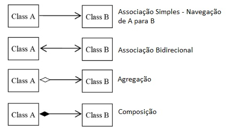

# Uml
Linguagem de Modelagem Unificada é uma notação que possibilita uma visualização gráfica do projeto
Na UML temos três conceitos para compreendermos inicialmente: 

**diagramas**, **elementos** e **relacionamentos**.

As notações UML são distribuidas em duas categorias de diagramas> 

## Diagramas estruturais 
+ Diagramas de classe: O Diagrama de Classes é utilizado para fazer a representação de estruturas de classe

+ Diagrama de objetos: Este diagrama representa os objetos existentes 

## Diagrama de classe 

O diagrama de classes ilustra **graficamente** como classes serão estruturadas e interligadas entre si. 
Ela é constituida por: 

**Identificação:** Nome e/ou finalidade
**Atributos:** Propriedades e/ou características
**Operações:** Ações e/ou métodos

## Relacionamentos 
Em um diagrama as classes podem exister de forma independente, contudo haverá alguns momentos que há a necessidade de se relacionarem. Com isso devemos compreender o nível de dependência entre elas: 

### Associação 
Define um relacionamento entre duas classes, permitindo que um objeto tenha acesso a estrutura de um outro objeto.

+ **Agregação:** Em uma agregação a classe principal contém uma relação com outra classe mas ela pode existir sem a classe agregadora

    
+ **Composição:** A composição já caracteriza uma dependência entre a classe principal e a classe associada.

### Multiplicidade

Os relacionamentos entre classes não se limitam a apenas **um para um**, um determinado cenário poderá  exigir multiplicidades específicas conforme opções abaixo: 

+ 1. -> Representa uma associação **contendo um elemento**
+ *. -> Representa uma associação **contendo uma lista de elementos**
+ 0..1 -> Representa uma associação **contendo zero ou um elemento** 
+ 0..* -> Representa uma associação **contendo zero ou uma lista de elementos.**
+ 1..* -> Representa uma associação **contendo um ou uma lista de elementos**

## Visibilidade 
Os atributos e métodos de uma classe podem receber níveis de visibilidade, e na UML existem símbolos que representam cada um deles 

+ (+) Visibilidade pública 
+ (#) Visibilidade protegida (muita associada com herança)  
+ (-) Visibilidade privada

Representação: 

